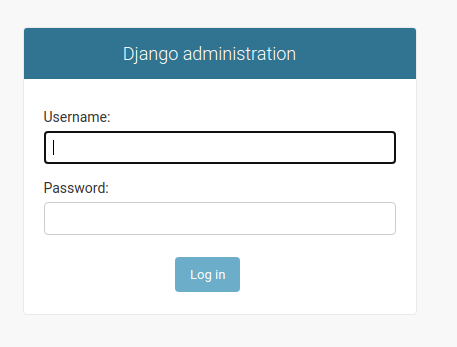
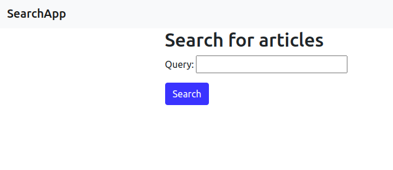

# Django, PostgreSQL, uWSGI and Nginx Docker deployment

## Overview 
This is a step-by-step guide on how to develop a simple search application using Django and PostreSQL to run on Docker. Uwsgi is used to serve the django application while nginx is used to serve the static files.

Dependencies
1. Django
2. Docker
3. Python
4. uwsgi
5. Nginx

## Project Setup
Create a new directory named django_search for the entire project, a virtual environment, install Django and create Django project using the following commands:


```code
$ mkdir django_search && cd django_search`
python3.8 -m venv env
source env/bin/activate
(env)$ pip install django
(env)$ django-admin.py startproject django_search 
(env)$ python manage.py runserver
```

The last command runs the django development server and you can access the application by navigating to http://localhost:8000/ on your browser and you will be greated with a django welcome screen. Generate a requirements.txt file using the pip freeze command `pip freeze > django_search/requirements.txt`. Next, configure the `DATABASES` list in the django project settings file. Add the correct credentials and settings in order for the application to be able to connect to a PostgreSQL database.

# Application development

## Create Django app
Create a Django application called search in the project root directory. 

```code
django-admin startapp search
```

Next, develop the `Article` model and give it the following fields `title`, `slug`, `body` and `created`. Now register the article model in the admin file of the search app. This makes it possible to view and manipulate the model using the Django admin interface.  Remember to add the search app to the `INSTALLED_APPS` list in the project settings file. Finally, generate migrations and run the migrations using the following commands:
```code
python manage.py makemigrations
python manage.py migrate
```

The commands are part of the django migration system that is responsible for tracking the changes made to the application models. In order to access the django admin, create a super user utilizing the following command:
`python manage.py createsuperuser`

Use, the credentials that you have registered the super user with to log into the django admin using http://localhost:8000/admin URL. You will see a login page as illustrated by the image below:



You can navigate in the dashboard and head to create new article as visualized in the next screenshot:


## Add search capability
The next stage is to develop the form that will be used to conduct a search.  The search capability will be a full-text search using PostgreSQL and django. Edit the `INSTALLED_APPS` settings and add the django-postgres module. Create a custom form to collect the search terms from the user by creating a `forms.py` file in the search app. Add the following code to the file:
```python
class SearchForm(forms.Form):
     query = forms.CharField()
```

Next, add a view function to which will display the form to collect the search term and return a results page. The view function will grab the search term and use the **SearchVector** and **SearchRank** modules. The view instantiates the `SearchForm`, confirms the submission via the query parameter and also checks whether the data from the form is valid. If the form is okay, the title field is passed to a `SearchVector` instance that is also translated by `SearchRank`  to filter the results. 

Create a templates directory and add a **search.html** file. This template will display the form and the search results. Register the search application urls in the project urls file. Lastly, add a **urls.py** file in the search application, import the views and add the following URL pattern:
```python
path('search/', article_search, name='article_search')
```

Test the functionality by navigating to the link http://localhost:8000/search/,  enter a search term and click the search button. The results page should be similar the following illustrated image:


The results of the search will be displayed as shown in the following screenshot: 


## Serving the application using uwsgi
The uWSGI application server is responsible for serving the django application in a versatile, low-resource consumption 
and reliable fashion. Install uWSGI into the virtualenv using the following command and update the requirements.txt file:
```code 
pip install uwsgi
```

To serve the application, use the command below:
```code
uwsgi --http :8000 --chdir=django_search --module django_search.wsgi
```

The `--chdir` option allows uwsgi to navigate the django project folder in order to load the project modules while the 
`--http` option defines the port that the application will be run on.

# Deploying the Django app using Docker
Create a Dockerfile in the django project folder and add code for the following steps:
1. Define the base image.
2. Define the working directory for the django application.
3. Define environment variables for preventing python from writing pyc files and buffering the standard output and 
standard error messages.
4. Copy the requirements.txt file and install the dependencies
5. Copy project files to the working directory.

Next, add a docker-compose file to the project root. Docker-compose is a tool for running multi-container applications. 
The compose file is used to define one or more containers, building application images and running the containers. Now 
run the following commands in order to build the Django application image and run the container:
```code
docker-compose build
docker-compose up -d
```

Navigate to  http://localhost:8000/search/ to access the search application. 

## Serving the application with Nginx
Create a folder called nginx in the root project folder and add a dockerfile and a docker-compose file for setting up a 
reverse proxy server using Nginx. Update the docker-compose file by adding a service called nginx with `build` and `ports`
configurations.

##Areas for improvement
This guide illustrated how to setup a Django application, uwsgi and Nginx using Docker. A few things to for refinement 
include:
1. Using a docker-based PostgreSQL setup.
2. Configuring uwsgi using a .ini file to accommodate more configuration
3. Adding tests for the article model, search form, article_search view.
4. Using separate dockerfiles and dock-compose files for development and production environments.
5. Adding **CI/CD** pipeline scripts for continuous integration and continuous  delivery.
